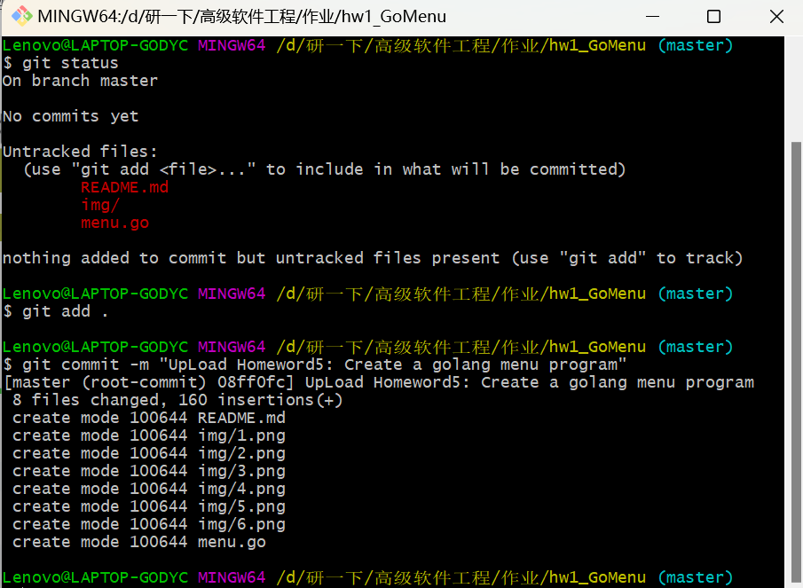

## 高软作业5：windows下vscode配置go编译调试环境并编写menu程序
>author: 494

### 一、安装golang编译环境
1. vscode下安装go

在vscode左侧的扩展工具中搜索"go"，点击安装第一个插件（Go）。


2. 通过[下载地址](https://studygolang.com/dl)下载并安装go，这里选择用msi下载文件进行安装。

3. 按默认步骤安装go语言，安装过程中会自动将go的路径添加到系统的环境变量中。

### 二、编写程序并测试
4. 打开命令行输入命令“go version”查看go版本，测试是否安装成功。

5. 编写menu.go菜单程序
```go
package main
 
import "fmt"

type dealFunc func()

type DataNode struct{
	cmd string
	desc string
	handler dealFunc
	next *DataNode
}

var head [3]DataNode = [3]DataNode{
	{"help", "this is help cmd!", Help, nil},
	{"version", "menu program v1.0", nil, nil},
	{"quit", "Quit from menu", Quit, nil},
}

// 因为golang不支持静态变量，无法在Help函数中直接读取head中的变量(cmd和desc)
// 因此将字符串部分单独提取出来给Help做变量
var info [3]string = [3]string{
	"help - this is help cmd!",
	"version - menu program v1.0",
	"quit - Quit from menu",
}

func Help(){
	fmt.Println("Menu List:")
	fmt.Println("=========================")
	var p string
	for i:=0;i<3;i++ {
		p = info[i]
		fmt.Println(p)
	}
	fmt.Println("=========================")
}

func Quit() {
	panic("Quit!")
}

func main() {
	// 同理，由于golang不支持静态变量，为了避免head出现循环初始化的情况
	// head初始化需要将next全部置为nil，在主函数中（此时head已经完成了初始化）再设置next的值
	for i:=0; i<len(head)-1; i++ {
		head[i].next = &head[i+1]
	}
	for {
		var cmd string
		fmt.Print("Input a cmd number(Input \"help\" for tips) > ")
		fmt.Scan(&cmd)
		var p *DataNode = &head[0]
		for p != nil {
			if p.cmd == cmd{
				fmt.Println(p.cmd + " - " + p.desc)
				if p.handler != nil {
					p.handler()
				}
				break
			}
			p = p.next
		}
		if p == nil{
			fmt.Println("This is a wrong cmd!")
		}
	}
}
```
6. 本地运行测试，输入指令
>go run menu.go

最后的运行结果如下图所示：

### 三、创建版本库，上传到github
7. 在github上创建远程仓库

8. 本地初始化git，查看提交状态，添加文件到本地缓存，最后提交到本地仓库
> * git init
> * git status
> * git add .
> * git commit -m "xxxx"


9. 与远程仓库建立连接并push到远程仓库
> * git remote add orgin
> * git remote add origin git@github.com:用户名/仓库名.git（使用ssh连接远程仓库）
> * git push -u origin master

